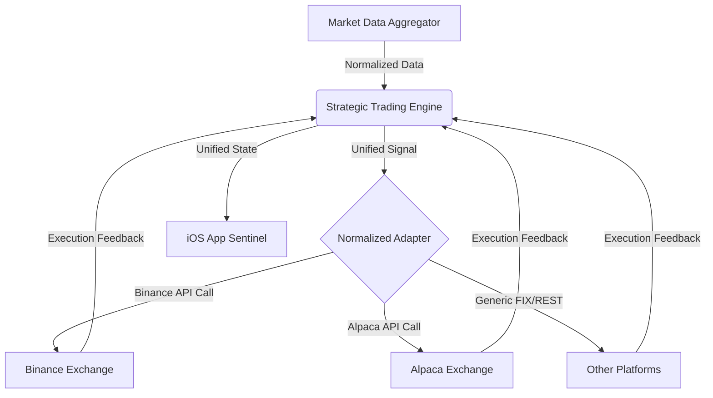

# Implementation Plan: Mobile Automated Trading System (MATS)

Building an automated trading system for iOS involves balancing high-performance execution with stringent App Store policies and financial regulations. This plan outlines a resilient, compliant, and secure architecture.

## User Review Required

> [!IMPORTANT]
> **Architecture Decision**: This plan proposes a **Hybrid Model**. The iOS app will serve as the Command & Control (C2) interface, while the actual trading logic resides on a secure, low-latency server. Running autonomous trading logic solely on a mobile device is highly discouraged due to background execution limits (iOS kills background processes) and connectivity instability.
> [!WARNING]
> **Execution Complexity**: Advanced Mode involves **Multi-Timeframe (MTF)** analysis. This increases the data fetching load on your MT5 terminal and may require a more stable internet connection to prevent lag.

### Phase 1: Institutional Core (MTF + IPA)

## 1. Clarifying Questions (Immediate Scope)

Before finalizing the tech stack, we need confirmation on:

- **Instruments**: (Equities, Crypto, Forex?)
- **Jurisdiction**: (US/FINRA, EU/ESMA, UK/FCA?)
- **User Ownership**: (Personal use vs. Multi-user retail platform?)
- **Execution**: (Fully autonomous vs. One-tap user approval?)

---

## 2. High-Level Architecture (Multi-Exchange Ready)

### Components

1. **Trading Engine (Server-Side)**: Core strategic logic (Signal Generation).
2. **Unified Exchange Adapter (The "Normalized" Layer)**: A translation layer that converts strategic signals into exchange-specific API calls (REST/WS). This handles the differences between **Binance** (Crypto), **Alpaca** (Equities), and others.
3. **iOS Sentinel App (Swift)**: Multi-platform portfolio dashboard and unified kill-switch.
4. **Rate Limit Manager**: Centralized tracking to ensure the bot doesn't trigger "429 Too Many Requests" across disparate APIs.

### Data Flow

---

## 3. Tech Stack

- **Frontend**: Swift (SwiftUI) with Combine/Async-Await.
- **Backend Core**: Golang or Python (FastAPI).
- **Exchange Integration**:
  - **CCXT (Python/Node)**: For robust Crypto integration across 100+ exchanges including Binance.
  - **Custom Go-structs**: For low-latency Equities platforms.

- **Persistence**: Redis (Real-time state) + PostgreSQL (Audit/Trade history).
- **Security**: OAuth2 and HW-backed Secure Enclave for local session keys.

---

## 4. Compliance & Risk Guidance

### Regulatory Landscape

- **KYC/AML**: If handling multiple users, integration with providers like Onfido or Persona is required.
- **Market Integrity**: Logic must include checks for "Wash Trading" and "Spoofing" to prevent regulatory fines.
- **Licensing**: Personal bots are usually exempt; public-facing bots often require Investment Advisor (RIA) registration.

### Risk Mitigations

- **Kill-Switch**: A hardware-level "Stop All" button on the iOS app.
- **Circuit Breakers**: Stop trading if a single trade loses >X% or if daily loss exceeds $Y.
- **Connectivity Failsafe**: Automatic order cancellation if the engine loses connection to the broker.

---

## 5. MVP Plan (Phased Milestones)

| Phase | Content | Duration |
| :--- | :--- | :--- |
| **Phase 1: Research** | API keys, Broker Sandbox setup, Legal review. | 2 Weeks |
| **Phase 2: Core Engine** | Market data ingestion + Basic SL/TP logic + Server-Broker handshake. | 4 Weeks |
| **Phase 3: iOS Interface** | Dashboard, Execution monitoring, and Kill-switch. | 3 Weeks |
| **Phase 4: Safety Testing** | "Paper Trading" (Simulated) for 30 days to validate logic. | 4 Weeks |
| **Phase 5: Compliance** | Audit logging setup + Penetration testing. | 2 Weeks |

---

## 6. Developer Notes: Security Best Practices

1. **API Key Management**: Never store secrets in `@AppStorage` or plaintext. Use **iOS Keychain**.
2. **End-to-End Encryption**: All traffic between iOS and Server must use Certificate Pinning to prevent Man-in-the-Middle attacks.
3. **Biometric Locks**: Entry to the trading dashboard must require FaceID/TouchID.
4. **Cloud Security**: Use IAM roles with "Least Privilege" for the trading engine. It should only have "Trade" and "View" permissions, NOT "Withdraw".

---

## 7. Non-Functional Requirements

- **Latency**: Sub-200ms for Signal-to-Order execution.
- **Availability**: 99.9% uptime during market hours.
- **Monitoring**: Real-time alerts via PagerDuty/Slack if the bot encounters a 4xx/5xx API error.
- **Rollback**: One-command version rollback for the server logic.

---

## 8. Ethical & Consent Considerations

- **Transparent Warnings**: "Automated trading involves significant risk of capital loss."
- **User Consent**: Clear opt-in for algorithmic execution.
- **Audit Trails**: Every trade must link back to the specific version of the strategy that triggered it.
